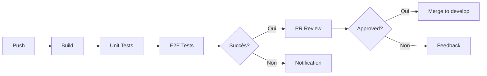
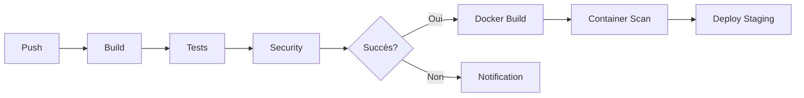
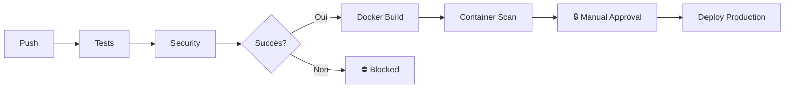

# CI/CD Setup - GitHub Actions & GitLab CI/CD

## 🔄 GitHub Actions

### Configuration
- **Fichier**: `.github/workflows/ci-cd.yml`
- **Declencheurs**: Pushes et Pull Requests sur `main` et `develop`

### Stages

#### 1️⃣ Build and Test
```yaml
- Installe les dépendances
- Build l'application
- Exécute les tests unitaires
- Upload la couverture à Codecov
```

#### 2️⃣ E2E Tests
```yaml
- Lance les services (PostgreSQL, Mailpit)
- Exécute les tests Playwright
- Génère les rapports Playwright
```

#### 3️⃣ Security
```yaml
- npm audit pour les vulnérabilités
- Snyk scan (si token configuré)
```

#### 4️⃣ Docker Build
```yaml
- Build l'image Docker
- Push vers ghcr.io
- S'exécute uniquement sur main/develop
```

#### 5️⃣ Container Security
```yaml
- Scan Trivy de l'image
- Upload vers GitHub Security
```

### Variables d'environnement requises

#### Secrets GitHub
```
SNYK_TOKEN - Token Snyk pour les scans de sécurité
```

Configuration:
1. Aller sur `Settings` → `Secrets and variables` → `Actions`
2. Ajouter un nouveau secret `SNYK_TOKEN`

### Détails des jobs

```yaml
build-and-test:
  runs-on: ubuntu-latest
  strategy:
    matrix:
      node-version: [20.x]
  # Installe Node, dépendances, build, tests

e2e-tests:
  needs: build-and-test
  services:
    - postgres:16-alpine
    - mailpit
  # Teste les flux utilisateur complets

security:
  needs: build-and-test
  # Scans de vulnérabilités

build-docker:
  needs: [build-and-test, e2e-tests]
  only: main, develop
  # Build et push de l'image Docker

container-scan:
  needs: build-docker
  only: main, develop
  # Scan de l'image Docker avec Trivy
```

### Rapports et artifacts

| Rapport | Location | Rétention |
|---------|----------|-----------|
| Unit Tests | `coverage/` | 30 jours |
| E2E Tests | `playwright-report/` | 30 jours |
| Coverage LCOV | Codecov | Intégration cloud |
| Security Scan | GitHub Security | Continu |

---

## 📊 GitLab CI/CD

### Configuration
- **Fichier**: `.gitlab-ci.yml`
- **Declencheurs**: Pushes et Merge Requests

### Stages

#### 📦 Build
```yaml
- Installe npm
- Build l'application
- Cache les dépendances
```

#### 🧪 Test
```yaml
Unit Tests:
  - Exécute Karma + Jasmine
  - Génère rapports de couverture

E2E Tests:
  - Installe Playwright
  - Lance les services
  - Exécute les tests
```

#### 🔒 Security
```yaml
npm-audit:
  - Vérification des dépendances

semgrep-sast:
  - Analyse statique du code
```

#### 🐳 Image
```yaml
docker-build:
  - Build et push vers le registre
  - S'exécute sur main/develop

trivy-scan:
  - Scan de vulnérabilités
```

#### 🚀 Deploy
```yaml
deploy-staging:
  - Déploie sur staging
  - Déclenché automatiquement sur develop

deploy-production:
  - Déploie sur production
  - Déclenchement manuel sur main
```

### Configuration GitLab

#### 1. Container Registry
```bash
# Dans GitLab Settings → CI/CD → Container Registry
# Activer le registre Docker
```

#### 2. Runner Configuration
```yaml
# config.toml du GitLab Runner
[[runners]]
  [runners.docker]
    image = "docker:latest"
    privileged = true
```

#### 3. Variables d'environnement

Aller sur `Settings` → `CI/CD` → `Variables`:

```
CI_REGISTRY_USER        = Username GitLab
CI_REGISTRY_PASSWORD    = Token d'accès personnel
CI_REGISTRY             = registry.gitlab.com
DOCKER_DRIVER           = overlay2
DOCKER_TLS_CERTDIR      = (vide)
```

### Artifacts et Reports

| Rapport | Format | Cache |
|---------|--------|-------|
| Unit Tests | JUnit XML | 30 jours |
| Coverage | Cobertura | 30 jours |
| E2E Tests | JUnit XML | 30 jours |
| Security | Semgrep JSON | 30 jours |

---

## 🔄 Flux de travail typique

### Pour une branche `feature`



### Pour `develop`



### Pour `main`



---

## 📋 Checklist avant Push

- [ ] Les tests unitaires passent: `npm test`
- [ ] Les tests E2E passent: `npm run e2e`
- [ ] Pas d'erreurs de build: `npm run build`
- [ ] Code couvert > 80%: Vérifier `coverage/index.html`
- [ ] Pas de vulnérabilités npm: `npm audit`
- [ ] Docker build localement: `docker build .`

---

## 🔧 Debugging

### GitHub Actions
```bash
# Voir les logs en direct
# Aller sur Actions → Workflow → Run
```

### GitLab CI/CD
```bash
# Voir les logs
# Aller sur CI/CD → Pipelines → Job
```

### Docker build échoue
```bash
# Debug localement
docker build --progress=plain .

# Vérifier les dépendances
npm ci --no-optional
```

### Tests échouent en CI mais pas localement
```bash
# Exécuter en mode CI strict
CI=true npm test
CI=true npm run e2e
```

---

## 📞 Support et Documentation

- [GitHub Actions Docs](https://docs.github.com/en/actions)
- [GitLab CI/CD Docs](https://docs.gitlab.com/ee/ci/)
- [Playwright Docs](https://playwright.dev)
- [Docker Docs](https://docs.docker.com)
- [Trivy Docs](https://github.com/aquasecurity/trivy)
